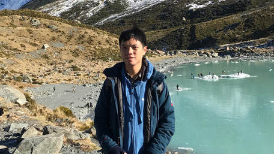
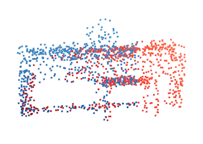
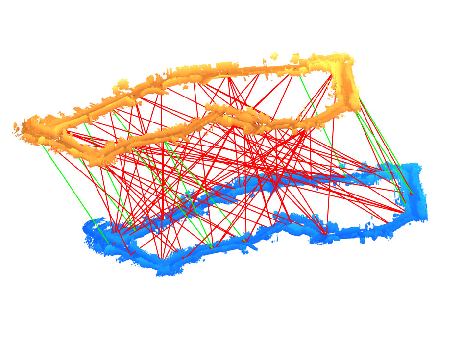
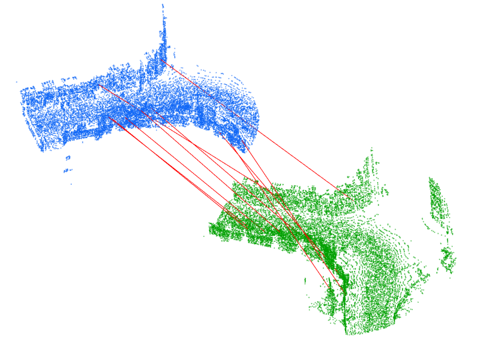

## About me
I am a Computer Science PhD student at the National University of Singapore, working under the supervision of [Gim Hee Lee](https://sites.google.com/site/gimheelee/).  Previously, I obtained my Bachelors of Engineering (Computer Engineering) from National University of Singapore in 2011. After graduating, I worked several years in DSO National Laboratories, which is Singapore's Defence R&D organization. During that time I also obtained a Computer Science Masters from Georgia Institute of Technology under their [OMSCS](http://www.omscs.gatech.edu) program.  My research interest is in Computer Vision, particularly in the area of Deep Learning and 3D Vision. To keep my sanity, my personal interests include consumer technology and [photography](photography).

My CV can be found <a href="assets/cv_simple.pdf">here</a>. I can be contacted at zijian.yew at comp.nus.edu.sg .

## Publications {#publications}
<table>
  <tr>
		<td width="30%">
			
		</td>
		<td width="70%">
			

				RPM-Net: Robust Point Matching using Learned Features
			

			

				Zi Jian Yew and Gim Hee Lee 
				CVPR 2020
			

			

				[<a href="https://arxiv.org/pdf/2003.13479.pdf">Paper</a>]
				[<a href="https://arxiv.org/src/2003.13479v1/anc/supplementary.pdf">Supplementary Material</a>]
				[<a href="https://github.com/yewzijian/RPMNet">Code</a>]
			

		</td>
	</tr>
	<tr>
		<td width="30%">
			
		</td>
		<td width="70%">
			

				Robust Point Cloud Based Reconstruction of Large-Scale Outdoor Scenes
			

			

				Ziquan Lan, Zi Jian Yew, Gim Hee Lee 
				CVPR 2019
			

			

				[<a href="https://arxiv.org/pdf/1905.09634">Paper</a>]
				[<a href="https://github.com/ziquan111/RobustPCLReconstruction">Code</a>]
			

		</td>
	</tr>
	<tr>
		<td width="30%">
			
		</td>
		<td width="70%">
			

				3DFeat-Net: Weakly Supervised Local 3D Features for Point Cloud Registration
			

			

				Zi Jian Yew and Gim Hee Lee 
				ECCV 2018
			

			

				[<a href="https://arxiv.org/pdf/1807.09413">Paper</a>]
				[<a href="https://arxiv.org/src/1807.09413v1/anc/supplementary.pdf">Supplementary Material</a>]
				[<a href="https://github.com/yewzijian/3DFeatNet">Code</a>]
			

		</td>
	</tr>
</table>