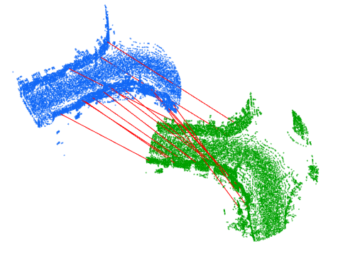

## About me
I'm currently an AI research engineer at [Hyundai Motor Group Innovation Center in Singapore (HMGICS)](https://hyundaisingapore.com). Previously, I did my PhD at the National University of Singapore under the supervision of [Gim Hee Lee](https://www.comp.nus.edu.sg/~leegh/).  Before that, I also worked several years in DSO National Laboratories, which is Singapore's defence R&D organization.  My research interest is in Computer Vision (particularly in 3D related topics, both deep and non-deep). To keep my sanity, my personal interests include consumer technology and [photography](photography).

I can be contacted at yewzijian at u.nus.edu .

## Publications {#publications}
<table>
  <tr>
		<td width="30%">
			
		</td>
		<td width="70%">
			

				REGTR: End-to-end Point Cloud Correspondences with Transformers
			

			

				Zi Jian Yew and Gim Hee Lee 
				CVPR 2022
			

			

				[<a href="https://arxiv.org/pdf/2203.14517.pdf">Paper</a>]
				[<a href="https://github.com/yewzijian/RegTR">Code</a>]
			

		</td>
	</tr>
	<tr>
		<td width="30%">
			
		</td>
		<td width="70%">
			

				Learning Iterative Robust Transformation Synchronization
			

			

				Zi Jian Yew and Gim Hee Lee 
				3DV 2021
			

			

				[<a href="https://arxiv.org/pdf/2111.00728.pdf">Paper</a>]
				[<a href="https://github.com/yewzijian/MultiReg">Code</a>]
			

		</td>
	</tr>
	<tr>
		<td width="30%">
			
		</td>
		<td width="70%">
			

				City-scale Scene Change Detection using Point Clouds
			

			

				Zi Jian Yew and Gim Hee Lee 
				ICRA 2021
			

			

				[<a href="https://arxiv.org/pdf/2103.14314.pdf">Paper</a>]
				[<a href="https://yewzijian.github.io/ChangeDet/">Project page</a>]
			

		</td>
	</tr>
  <tr>
		<td width="30%">
			
		</td>
		<td width="70%">
			

				RPM-Net: Robust Point Matching using Learned Features
			

			

				Zi Jian Yew and Gim Hee Lee 
				CVPR 2020
			

			

				[<a href="https://arxiv.org/pdf/2003.13479.pdf">Paper</a>]
				[<a href="https://arxiv.org/src/2003.13479v1/anc/supplementary.pdf">Supplementary Material</a>]
				[<a href="https://github.com/yewzijian/RPMNet">Code</a>]
			

		</td>
	</tr>
	<tr>
		<td width="30%">
			
		</td>
		<td width="70%">
			

				Robust Point Cloud Based Reconstruction of Large-Scale Outdoor Scenes
			

			

				Ziquan Lan, Zi Jian Yew, Gim Hee Lee 
				CVPR 2019
			

			

				[<a href="https://arxiv.org/pdf/1905.09634">Paper</a>]
				[<a href="https://github.com/ziquan111/RobustPCLReconstruction">Code</a>]
			

		</td>
	</tr>
	<tr>
		<td width="30%">
			
		</td>
		<td width="70%">
			

				3DFeat-Net: Weakly Supervised Local 3D Features for Point Cloud Registration
			

			

				Zi Jian Yew and Gim Hee Lee 
				ECCV 2018
			

			

				[<a href="https://arxiv.org/pdf/1807.09413">Paper</a>]
				[<a href="https://arxiv.org/src/1807.09413v1/anc/supplementary.pdf">Supplementary Material</a>]
				[<a href="https://github.com/yewzijian/3DFeatNet">Code</a>]
			

		</td>
	</tr>
</table>